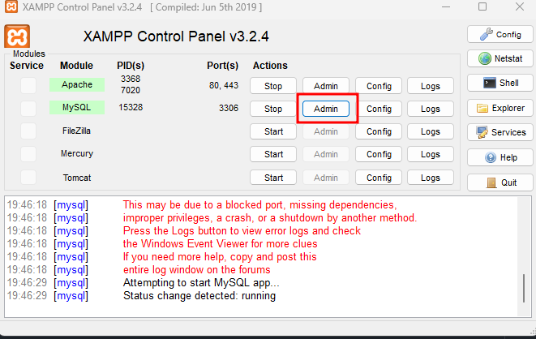
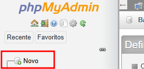
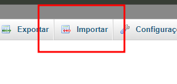
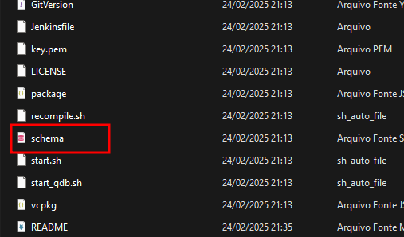

# Globaiak - Canary

Globaiak is an alternative Tibia server created by a group of friends who wanted to relive the nostalgia of the good old days of playing Tibia. Our goal is to provide the same fun and excitement that we experienced back then. Join us and have fun!

## Getting Started

To configure the project, you’ll first need to download and install the necessary tools:

1. XAMPP (download link): XAMPP for MySQL and PHP
    XAMPP is a free and open-source cross-platform web server solution that includes MySQL, PHP, and Apache.

2. Start MySQL: After installing XAMPP, launch the XAMPP Control Panel. Then, start the MySQL instance by clicking Start next to the MySQL module. Once MySQL is running, click Admin to open the phpMyAdmin control panel.

3. Create the Database: In phpMyAdmin, click on New (or "Novo" if your phpMyAdmin is in another language) to create a new database.

4. Import the SQL Schema: Next, click on the Import tab to upload the SQL schema file. This file will be located within the otserv project folder.

5. Select the SQL File: In the Import section, click the Choose File button and select the .sql schema file to migrate the database.

These are the steps so that the website is correctly configured, but this project will be up soon in this repository;

After that just open project on file explorer and run canary.exe, open your Tibia client and login :D